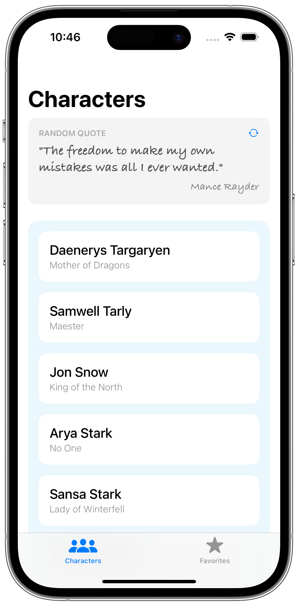
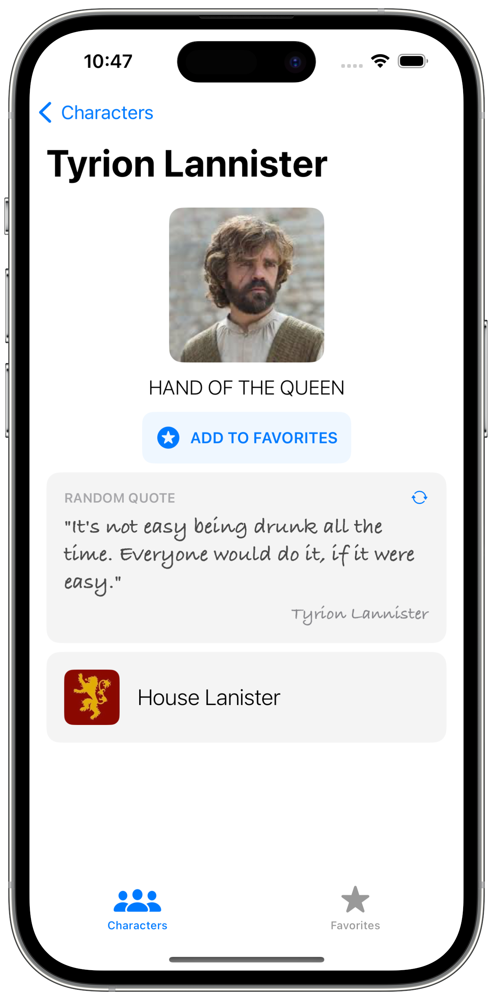
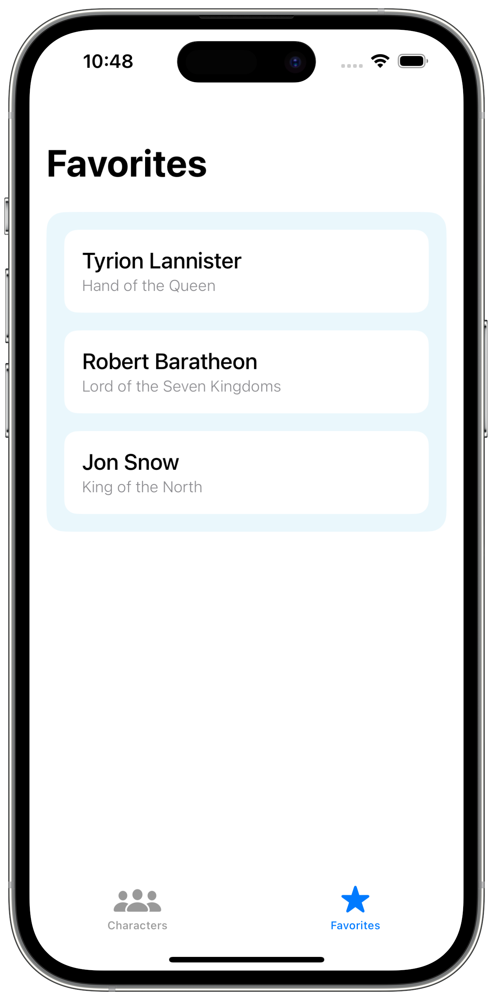

# Game of Thrones Wiki

  

Built with [The Composable Architecture](https://github.com/pointfreeco/swift-composable-architecture) for iOS, this app is your ticket to exploring the world of Westeros. Dive into character profiles, quotes, and create a list of favorite characters. 

    
    
    

> Mockups generated with [MockUPhone](https://mockuphone.com)

### APIs
- [Game of Thrones Quotes API](https://gameofthronesquotes.xyz)
- [Game of Thrones Character API](https://thronesapi.com)

### Disclaimer
I built this app when I was new to The Composable Architecture. If you find any implementation that deviates from the principles of the architecture or have suggestions for improvements, please feel free to open issues or pull requests. Your feedback is invaluable in helping me improve the app and my understanding of The Composable Architecture.

